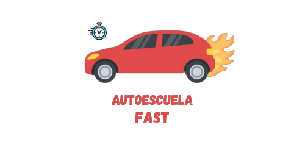

    
    <h1>Bienvenidos a Autoescuela Fast</h1>

**Test de autoescuela en la palma de tu mano.**

Autoescuela Fast es una aplicación diseñada para ayudarte a prepararte para el examen teórico del carnet de conducir de forma cómoda y eficaz.

## ✨ Características principales
- 📋 Realiza una gran variedad de test actualizados.
- 👤 Regístrate y lleva un seguimiento personalizado.
- 📊 Consulta tus estadísticas y progresos en tiempo real.
- 🏆 Desbloquea logros a medida que mejoras tus resultados.

## 🌐 Versión web del proyecto
También puedes acceder al repositorio en su versión web aquí (este desarrollo fue la idea inicial para realizar la versión web para el Trabajo final de 2 año):

👉 **[Ver versión web del proyecto](https://github.com/HuGymsForMe/ProyectoFinal2-Daw)**

